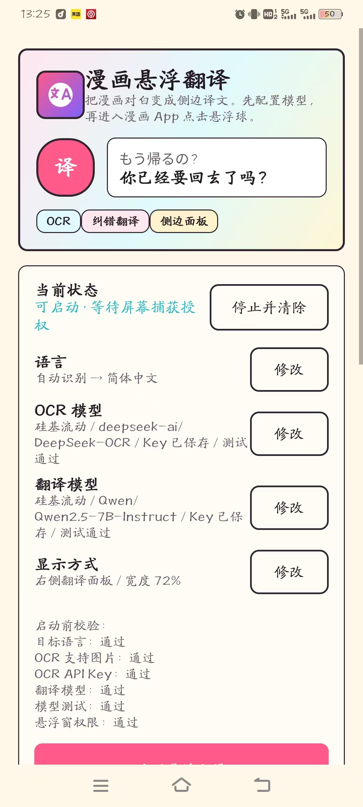

# 沉浸式漫画翻译

[English](./README.en.md)

> 面向漫画阅读场景的 Android OCR 悬浮翻译工具，可配置视觉模型与文本模型。


## 项目预览



## 为什么值得 Star / Fork

- 不是空仓库，而是能直接看懂用途的实用项目。
- 首屏就能看到真实截图，进入页面几秒内就能理解它在做什么。
- 适合学习、二次开发和按自己的阅读习惯改造。
- 同时保留中文和英文说明，方便不同用户阅读。

## 功能亮点

- 漫画阅读场景下的 OCR 悬浮翻译。
- 可配置 OCR 模型和翻译模型，适配不同使用习惯。
- 保持本地优先的工作流，便于调试和维护。
- 文档、截图和说明集中在一起，方便快速上手。

## 快速开始

```bash
gradlew.bat assembleDebug
```

## 项目结构

```text
.
|-- docs/                 截图、说明和补充资料
|-- README.md             GitHub 首页
|-- README.en.md          英文说明
`-- README.cn.md          中文说明
```

## 后续计划

- [ ] 补充更多真实使用截图和示例。
- [ ] 为主流程增加更多验证说明。
- [ ] 继续优化说明文档的可读性。
- [ ] 补足新手更容易照着做的步骤。

欢迎提交 Issue 和 PR。如果这个项目对你有帮助，Star 或 Fork 会让更多人更容易找到它。
